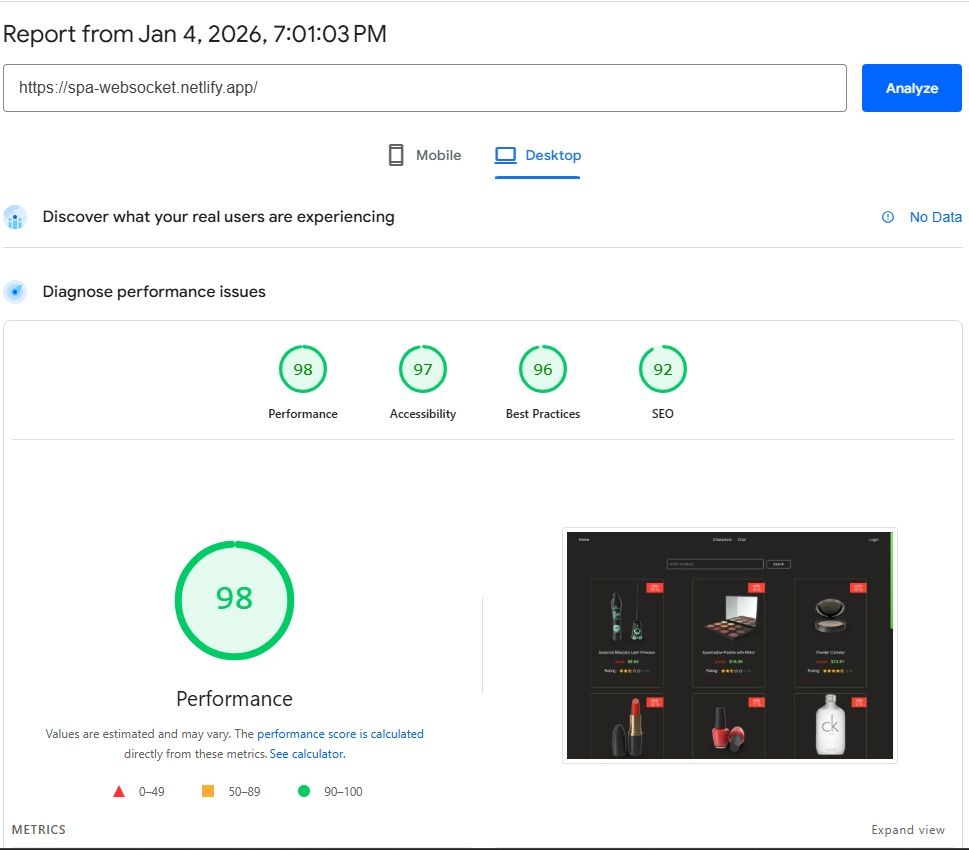
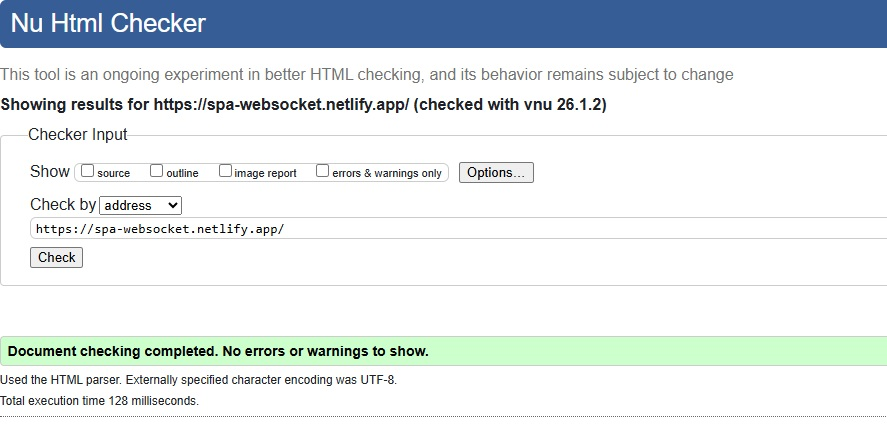

<a id="readme-top"></a>

<div align="center">
  <a href="https://github.com/othneildrew/Best-README-Template">
    
  </a>
  <h1 align="center">spa-websocket</h1>
</div>

<details>
  <summary><h2>Table of contents</h2></summary>
  <ol>
    <li>
      <a href="#about-project">About project</a>
      <ul>
        <li><a href="#description">Description</a></li>
        <li><a href="#-key-benefits">Key benefits</a></li>
        <li><a href="#technologies-used">Technologies Used</a></li>
        <li><a href="#project-architecture">Project architecture</a></li>
      </ul>
    </li>
    <li>
      <a href="#usage">Usage</a>
      <ul>
        <li><a href="#setup-instructions">Setup Instructions</a></li>
        <li><a href="#scripts-in-project">Scripts in project</a></li>
      </ul>
    </li>
    <li>
      <a href="#Performance">Performance</a>
    </li>
    <li>
      <a href="#the-following-people-were-involved-in-the-project">The following people were involved in the project</a>
    </li>
  </ol>
</details>

## About Project

DEPLOY: <a href="https://spa-websocket.netlify.app/">spa-websocket</a>

## Description

This is a task JST-2585 assignment for Innowise Group.
This task focuses on building a modern frontend application using React, TypeScript, and Vite, with an emphasis on type safety, routing, and asynchronous state management via the TanStack ecosystem.
Additionally, a WebSocket-based chat and GraphQL API integration have been implemented.

### 🔥 Key Benefits

- 🧭 **Intuitive and friendly UI**
- ⚡ **Fast loading and responsive design**
- 🛠️ **Modern tech stack (SPA)**
- 🧱 **Scalable FSD architecture — clean, modular, and easy to maintain**
- 🇹🇸  **Strict TypeScript setup — full type safety with zero any**
- ⚡ **High-performance SPA — powered by Vite and modern build tooling**
- 🧭 **Type-safe routing — implemented with TanStack Router**
- 🔄 **Efficient server-state management — caching and async handling via TanStack Query**
- 🧪 **Comprehensive testing — unit, module, and snapshot tests included**
- 🔌 **Real-time communication — WebSocket-based chat module**
- 🧩 **GraphQL integration — data fetching via a typed GraphQL API**

## Technologies Used

- Frontend

  - ⚛️ React
  - 🇹🇸  TypeScript
  - ⚡ Vite
  - 🧭 TanStack Router
  - 🔄 TanStack Query
  - 🎨 Tailwind CSS
  - 🔌 WebSocket (Echo Server)
  - 🧩 GraphQL API


- Utility: Linter
  - ❗ ESlint
  - 🧹 Lint-staged
  - 🪄 Prettier
  - 🐶 Husky

## Setup Instructions

1. Install Node.js v20.11.1

2. Obtain the Project Files: you have two options for obtaining the project files:

- Fork the Repository: If you plan to contribute to the project or make changes to the code, it's recommended to fork the repository. This will create a copy of the repository under your GitHub account. [Fork the repository](https://github.com/aQafresca/spa-websocket/fork) to create a copy under your account.

- Download the Repository: If you only intend to use the project locally and don't plan to contribute changes, you can simply download the repository as a ZIP file. [Download the repository](https://github.com/aQafresca/spa-websocket/archive/refs/heads/main.zip) as a ZIP file and extract it to your local machine.

3. Clone the Repository (if Forked): if you forked the repository, clone your newly created repo to your local machine using the following command:

```
git clone https://github.com/YOUR-USERNAME/spa-websocket.git
```

4. Navigate to the Project Directory: once you have obtained the project files (either by forking or downloading), navigate to the project directory:

```
cd spa-websocket
```

5. To install all dependencies use:

```
npm install
```

6. Run development version:

```
npm run dev
```

7. Build the Project:

to build the project, use the following command:

```
npm run build
```

<p align="right">(<a href="#readme-top">back to top</a>)</p>

## Test Account for Authorization

To log in to the application, use the following credentials:

- **Username:** `emilys`
- **Password:** `emilyspass`

<p align="right">(<a href="#readme-top">back to top</a>)</p>

## Project architecture

- app — Application initialization, global providers.
- pages — Page-level components.
- widgets — Independent UI blocks composed of features and entities.
- features — User interactions and business logic (actions, forms).
- entities — Core business entities and their models, logic, and UI.
- shared — Reusable UI components, utilities, hooks, and configuration.

<p align="right">(<a href="#readme-top">back to top</a>)</p>

## Scripts in project

1. `npm run dev` - Launches the project in development mode with live reloading.
2. `npm run generate-routes` - Generates application routes based on the project structure.
3. `npm run build` - Builds the project into the `dist` folder optimized for production.
4. `npm run format` - Formats all JavaScript and SCSS files using Prettier and Stylelint.
5. `npm run format:fix` - Automatically fixes formatting issues in JavaScript and SCSS files.
6. `npm run lint` - Runs ESLint to check JavaScript files for potential issues.
7. `npm run lint:fix` - Automatically fixes linting and formatting issues in JavaScript and SCSS files.
8. `npm run prepare` - Initializes Husky for managing Git hooks.
9. `npm run preview` - Serves the production build locally for preview and testing.
10. `npm run test` — Runs the test suite (unit, module, and snapshot tests).
11. `npm run coverage` — Generates a test coverage report.

<p align="right">(<a href="#readme-top">back to top</a>)</p>

### Performance

1. Lighthouse

   

2. W3C Validator

   


<p align="right">(<a href="#readme-top">back to top</a>)</p>

## The following people were involved in the project

### Authors

- [aQafresca](https://github.com/aQafresca)
